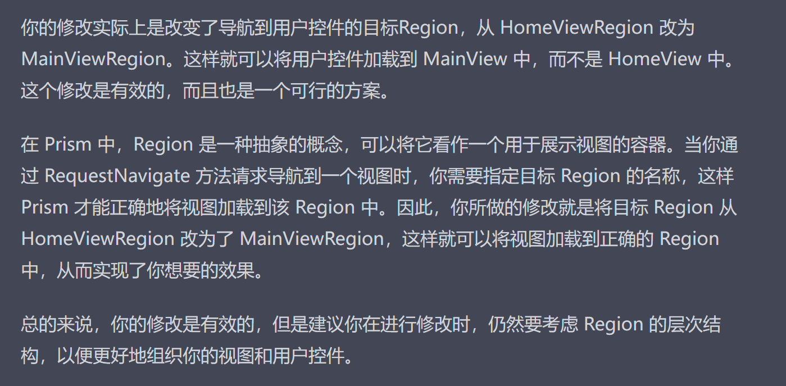
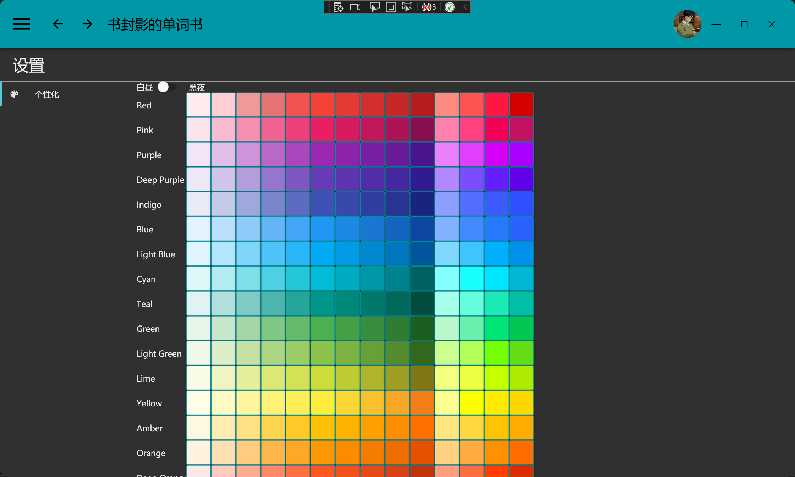
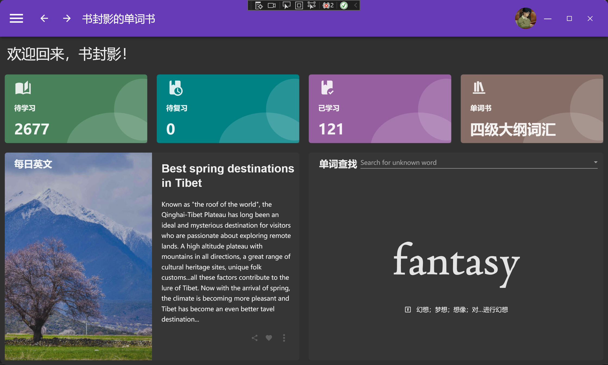
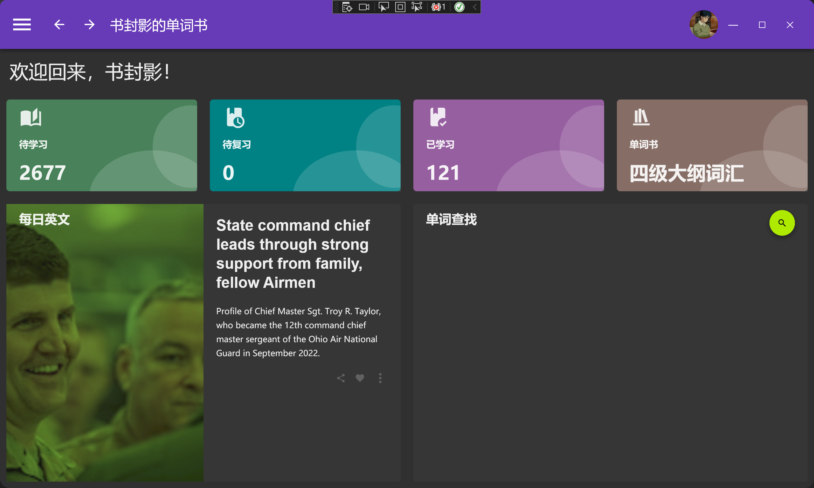
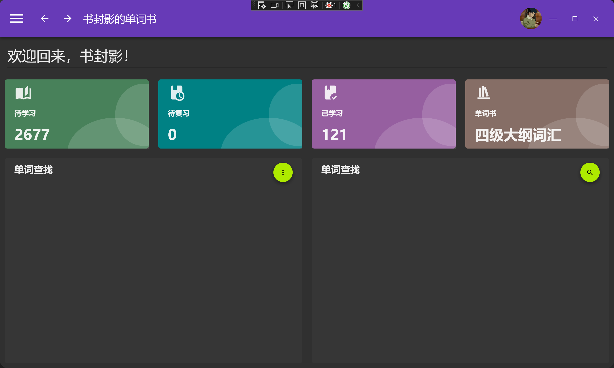
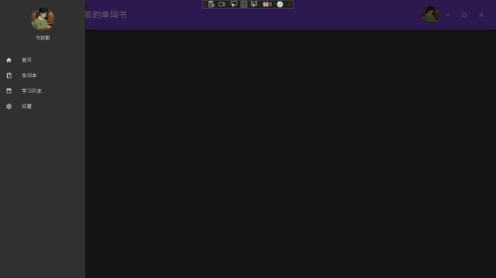

[English log translate by ChatGPT](https://github.com/ShuFengYingt/SFY-Word-Book/blob/master/README_en.md)

# 4.14 项目日志

暂时放弃了C语言后台的写法，暂时纯用C#代替实现，等以后再尝试（

完成了以下内容

1. 导入CET6.json词汇
2. 学习单词界面的部分UI效果实现

## 如何实现按下按钮隐藏控件

在写前台界面的时候，需要按下“认识”或者“不认识”按钮后将二者隐藏，但是在MVVM的模式下，需要进行额外的处理，怎么做呢？

这里就不踢按钮绑定命令Command的基本操作了，单纯来讲Visibility这个属性

这个属性有三个枚举值，分别为：

1. Visible
2. Hidden
3. Collasp

三个值的特点此处不表，重点是要进行绑定操作。

对于一个控件，类似如下

```xaml
<YourControl Visibility = "Visible"/>
```

为了实现绑定，我们这样改

```xaml
<YourControl Visibility = "{Binding IsShow , Converter = {StaticResource BooleanToVisibilityConverter}}"/>
```

可以看到，绑定了一个ViewModel（Prism框架下的业务分离）下的IsHidden属性，同时用了一个布尔转可视性的转换器。

对于IsHidden属性，我们需要在ViewModel下这样定义：

```C#
private bool isShow;
public bool IsShow
{
    get{return isShow;}
    set{SetProperty(ref isShow, value);}
    
}//记得在构造函数中初始化
```

除此之外，在Command调用的函数中，需要这样写：

```C#
public void Show()
{
    //略去其他代码
    
    IsShow = false;
    OnPropertyChanged(new PropertyChangedEventArgs(nameof(IsShow)));
}
```

这样在调用Command（调用函数时）,就能改变某个绑定了IsShow属性的控件的Visibility了。

# 4.11 项目日志

完成了C语言后台部分的内容，包括

1. 单词结构体
2. 例句结构体
3. 释义结构体
4. 链表创建函数
5. 增删改查

在CS端

1. Extension下新增公共类CSolve，

2. 引用C语言封装dll

3. 进行局部调用（也就是还没做完，而且没进行测试）


## C语言封装动态链接库

### 要点

首先完成CSolve.c文件后，在头文件中创建CSolve.h(同名文件)，并在CSolve.c中进行如下引用

```C
#include"CSolve.h"
```

而后在CSolve.h中将函数进行引用，并添加修饰

```C
extern _declspec(dllexport) struct _Word* _CreateWordListHead();
```

修饰词为

```C
extern _declspec(dllexport)
```

这样就可以完成dll导出。

注意，变量尽量用下划线进行前修饰或者后修饰，和C#区分开来，这样可以明确哪些是内部的，哪些是外来的。

### 坑点

1. 在VS中要关闭预编译头
2. 要在项目属性中将项目类型转成dll

完成上述步骤之后，重新生成解决方案，就可以得到动态链接库源文件了。


## Csharp中引用C语言动态链接库

### 基本操作

1. 将动态链接库文件放入CS项目的运行环境中，也就是/bin/Debug/.net7-windows

2. 创建专门的管理类，我这里创建了一个CSolve类在Extension下，与PrismManager.cs平行

3. 使用DLLImport标记进行导入，示例如下：

   ```c#
   		[DllImport("CSloves.dll", EntryPoint = "_CreateWordBooks")]
            public static extern void _CreateWordBooks();
   
   ```

记得用EntryPoint指示入口函数

### 结构体导入要点

基本操作模式只能应付最简单的处理函数，但是动态链接库中的很多函数有指针变量，结构体嵌套等等，这些都需要更多的知识进行特殊处理。

#### 1.重声明结构体

对于动态链接库中定义好的结构体，我们需要在C#中重新再对等声明一遍，否则无法调用对应函数。但是由于C语言与C++的结构体声明是顺序的（从上至下，如果一个名为a_struct的结构体放在了最末端，那么前面的结构体和函数无法调用这个名为a_struct的结构体），所以在C#中，我们同样需要声明结构体是顺序放置的，如下示例

```c#
    using System.Runtime.InteropServices;

	   [StructLayout(LayoutKind.Sequential)]
        public struct Sentence
        {
            
        }

```

#### 2.char*  转换（重中之重）

在C语言中，为了更方便地实现字符串功能，我在结构体中用char* 指针进行了字符串定义，类似如下

```C
            struct Sentence
            {
                 /// <summary>
    			/// 单词内容
    			/// </summary>
    			char* _sentenceContent;
            };
```

虽然C#可以在unsafe修饰下使用指针变量，但是都用C#了，谁还翻指针啊XD。

如果想在C#中不使用指针的情况下引用动态链接库的char* ，则需要用点新玩意了。

对于上述示例中的 **_sentenceContent** ，我们可以在C#的同等结构体中用**IntPtr**来进行定义

```c#
            public IntPtr _sentenceContent; 
```

仅是如此还不够，在调用函数或者生成方法时，需要对char* 进行发送和接受，而C#中接受char* 的方式我试了很多，只有一个是正常的，其他全部都会输出乱码，接下来对接受方式进行介绍。

假设我们有一个函数为(只是举个例子，实际代码并不是这样)

```c
struct _Sentence* _CreateSentenceInstance(char* _sentenceContent){}
```

那么我们可以在之前的结构体中，进行一定程度的封装

```c#
		   struct Sentence
            {
                 /// <summary>
    			/// 单词内容
    			/// </summary>
    			private IntPtr _sentenceContent;
               	 public string SentenceContent
                 {
                     get{return Marshal.PtrToStringUTF8(_sentenceContent); }
                 }
            };
```

这个过程中，我们将_sentenceContent数据成员隐藏了起来，取而代之的是string类型的SentenceContent属性，并且在返回上用了Marshal.PtrToStringUTF8()进行转化。

这个步骤是将IntPtr类型的_sentenceContent转化为UTF-8编码的字符串。

为什么要这么做呢，我们接着来看函数的封装

为了引用在上文给出的返回结构体指针变量的*_CreateSentenceInstance*函数，我们在C#中应该进行如下导入：

```c#
        [DllImport("CSolves.dll", EntryPoint = "_CreateSentenceInstance", CallingConvention = CallingConvention.Cdecl)]
        private static extern IntPtr _CreateSentenceInstance(byte[] _sentenceContent);
```

不难发现，对于C语言中的char* ，在C#中，我们使用了byte[]数组来进行接收，这是因为char*的本质是一串连续地址，所以我们可以将我们需要传入的字符串转换为二进制的byte数组，也就是指定了其地址，再传入动态链接库当中。（应该是这么理解，吧）

进而，我们可以进一步对_CreateSentenceInstance进行封装，返回一个Struct

```c#
        /// <summary>
        /// 创建例句结构体实例
        /// </summary>
        /// <param name="sentenceContent"></param>
        /// <returns>Sentence Struct</returns>
        public static Sentence SentenceCreate(string sentenceContent)
        {
            byte[] _sentenceContentByte = Encoding.UTF8.GetBytes(sentenceContent);
            IntPtr sentencePtr = _CreateSentenceInstance(_sentenceContentByte);
            Sentence sentence = Marshal.PtrToStructure<Sentence>(sentencePtr);
            return sentence;
        }

```

这里进行了三个步骤

1. 将C#端传入的string使用`Encoding.UTF8.GetBytes()`方法转化为二进制数组
2. 调用`_CreateSentenceInstance`方法，将byte[]传入，动态链接库端自动完成byte-》char* 的对接专化
3. 使用`Marshal.PtrToStructure`方法完成指针的结构体化转化

这样的封装方式更适合C#的调用


# 4.9项目日志


1. 稍微做了一下背单词的UI界面，不过有待改进
2. 对WebAPI进行了相关配置
3. 创建了单词数据库，利用的是SQLite，不过不太明白要怎么实现增删查改，以及如何对接C语言

# 4.8项目日志
1. 为个性化板块添加了打开动画效果
2. 实现了主窗口的任务条的导航功能

## 当前待解决问题
1. 任务条显示问题（各种容器还是没有整明白）
2. 窗口预加载
3. 主窗口显示问题

## 坑点
我依据之前的Prism依赖注入导航方法尝试着让任务栏的按钮能够导航到对应的用户控件，导航确实是实现了，但是主用户控件和新用户控件出现了重叠问题，这实在是让人火大。

后来我发现是region的问题。

之前我在MainView下定义了一个region，通过这个region实现了菜单栏导航到各个页面。
```xml
                <ContentControl prism:RegionManager.RegionName="{x:Static extensions:PrismManager.MainViewRegionName}" />

```
而后我依葫芦画瓢，在HomeView下这样定义
```xml
                <ContentControl prism:RegionManager.RegionName="{x:Static extensions:PrismManager.HomeViewRegionName}" />

```
在HomeViewModel中，这样写方法:
```csharp
        private void Navigate(TaskBar taskBar)
        {
            if (taskBar == null || string.IsNullOrWhiteSpace(taskBar.NameSpace))
            {
                return;
            }
            regionManage.Regions[PrismManager.HomeViewRegion].RequestNavigate(taskBar.NameSpace);
        }

```
这就导致了用户控件重叠问题。而后我尝试将HomeView.xaml中的区域注册删除（其实删不删无所谓），将导航方法中的

```csharp
regionManage.Regions[PrismManager.HomeViewRegion].RequestNavigate(taskBar.NameSpace);
```
改写为
```csharp
            regionManage.Regions[PrismManager.MainViewRegionName].RequestNavigate(taskBar.NameSpace);

```
则成功解决了用户控件重叠问题。

这是因为MainView中注册的region是整个页面的region，区域为整个窗体，加载的所有的用户控件在窗体上显示。窗体本身没有东西，是空的。而HomeView中注册的region则区域为HomeView本身，在HomeViewRegion中加载的用户控件则自然会加载到HomeView上——这就导致了重叠。
用GPT的话说就是：


一个小坑。记一下。

# 4.7项目日志
1. 新增设置面板
2. 添加个性化功能
3. 修复了圆角窗口的细节


以及


# 4.6项目日志
1. 大部分实现了每日文章的功能，调用的是API，显示图片，标题，内容信息（还有很多bug等待明天和后天去修复）


## 等待修复的内容：
1. 圆角图片的实现
2. 文本长度的控制
3. 三大键位置

## 坑点
1. ItemTmplate造成的填充不满问题（原因未知，还要学）
2. API调用

## API调用心得
为了实现自动从网上获取每日资讯，我找到了一个API（只有500次token）。
我定义了一个DailyPage类在Model中（实际上叫DailyArticle更合适），包括以下几个属性（Property）
1. Image 图片
2. Title 标题
3. Content 内容
4. Flow 源地址（应该叫url更合适）

而后在HomeView当中，进行通知更新声明
```csharp
        //每日文章通知更新
        private ObservableCollection<DailyPage> dailyPages;
        public ObservableCollection<DailyPage> DailyPages
        {
            get { return dailyPages; }
            set { dailyPages = value; RaisePropertyChanged(); }
        }
```
为了调用API，建立了异步方法：
```csharp
        async void CreateDailyPage(){}

```
在其中，用如下代码体获取API-JSON信息
```csharp
 using (HttpClient client = new HttpClient())
            {
                HttpResponseMessage responseMessage = await client.GetAsync(apiUrlString);
                if (responseMessage.IsSuccessStatusCode)
                {
                    string responseContent = await responseMessage.Content.ReadAsStringAsync();
                    //解析Json
                    JObject jsonResponse = JObject.Parse(responseContent);
                    JArray articles = (JArray)jsonResponse["data"];
                }
            }
```
解析Json的类库CSharp并不自备，需要用Nuget引入，名为NewtonSoft.Json。这样就能用上面的方法体了。

由于我的Json是个数据集合，所以需要
```csharp
JArray articles = (JArray)jsonResponse["data"];
```
对data进行拆分。而后我写下了以下方法体
```csharp
  foreach (JToken article in articles)
                    {
                        if (articles.Count > 0)
                        {
                            string content = (string)article["description"];
                            if (content.Length > 500)
                            {
                                content = content.Substring(0, 500) + "...";
                            }
                            string image = (string)article["image"];
                            if (image == null || image.Contains('%') || image.Contains('&') || image.Contains('$'))
                            {
                                continue;
                            }
                            if (content.Length < 50)
                            {
                                continue;
                            }

                            DailyPages.Add(new DailyPage
                            {
                                Image = (string)article["image"],
                                Title = (string)article["title"],
                                Content = content,
                                Flow = (string)article["url"]
                                
                            });
                            break;
                        }
                    }
```
之所以要用到一个循环，是为了避免出现以下情况：
1. 图片乱码无法加载
2. 图片被加密过
3. 文字太多
4. 文字太少

这里面添加了实例化方法，即如下所示：
```csharp
DailyPages.Add(new DailyPage
                            {
                                Image = (string)article["image"],
                                Title = (string)article["title"],
                                Content = content,
                                Flow = (string)article["url"]
                                
                            });     
```
请注意这个语法
```csharp
Image = (string)article["image"]
```
这是很重要的Json解析语法，即将Json中的"image"标注数据专化为字符串赋值给属性当中。


# 4.5 项目日志
1. 完成了首页的UI
2. 将窗口替换为圆角
3. 遇到了有关MetarialDesign的Style的一大堆坑，艹！！！！




# 4.4 项目日志
# 实现了以下功能：

1. 用户在左侧菜单栏选中菜单的元素后导航至对应页面。
2. 导航后收起左侧菜单栏。
3. 允许用户使用导航条上的“—>”和“<—”键完成上一步和下一步的导航（利用导航日志实现）


# 坑点：

1. 需要使用“UserControl”来创建子页面，而不能用Window进行创建。
2. 命名规范上，Views文件夹下的页面要命名为xxxView，ViewModel文件夹下的页面需要命名为xxxViewModel
3. 创建页面后，一定一定要去App.xaml.cs下进行注册，否则无法完成导航工作！！！

# 要点:

## 1.注册

( 0 )创建子页面( UserControl )于View下，同时创建其对应的Model

( 1 ). 一定要在App.xaml.cs下的重写”RegisterTypes“方法中注册创建的子页面（UserControl）,示例代码如下：

```csharp
containerRegistry.RegisterForNavigation<HomeView,HomeViewModel> ();
```

泛型中分别填入”HomeView“和其对应的”HomeViewModel“进行自动关联，这是Prism框架的一个特性。

( 2 ). 在MainView.xaml下，注册主页区域。只有注册完毕才能进行下一步导航的具体操作。
主页区域注册xaml代码如下：

```xml
<ContentControl prism:RegionManager.RegionName="{x:Static extensions:PrismManager.MainViewRegionName}" />
```

注意到”PrismManager.MainViewRegionName“这段声明，这个需要我们自己去声明，声明过程为：

I：创建Extensions文件夹。
II:在其中创建PrismManager.cs，并且声明为”public“。在其下创建一个只读字符串，名为MainViewRegionName，其内容为MainViewRegion，这个命名格式应该是必要的。
III:在MainView.xaml下声明extension命名空间，举例如下：

```xml
xmlns:extensions="clr-namespace:SFY_Word_Book.Extensions"。
```

IV:而后注册区域，如上。

( 3 ).在MainViewModel下创建只读的IRegionManager接口的变量regionManager

```csharp
private readonly IRegionManager regionManager;
```

并在构造函数中进行实例化，如下：

```csharp
this.regionManager = regionManager;
```

至此，区域注册完毕，接下来实现菜单导航

# 2.实现菜单导航:

( 1 ).确定自己有CreateMenuBar这个方法，里面有类似于这样的构建菜单元素语句

```csharp
MenuBars.Add(new MenuBar() { Icon = "Home", Title = "首页", NameSpace = "HomeView" });
```

这段代码绑定的是MemuBar类，类下有Icon，Title和NameSpace三个属性，其中的NameSpace要和子页面名称一致（与在App.xaml.cs中注册的类一致）

( 2 ).确保有如下菜单更新代码

```csharp
				//菜单在主页的声明和更新
        private ObservableCollection<MenuBar> menuBars;
        public ObservableCollection<MenuBar> MenuBars
        {
            get { return menuBars; }
            set { menuBars = value; RaisePropertyChanged(); }
        }
```

( 3 ).声明导航委托,泛型类型为MenuBar

```csharp
public DelegateCommand<MenuBar> NavigateCommand { get; private set; }
```

( 4 ).构造导航方法Navigate，传入MenuBar类型的menuBar，注意，若其为空或者命名空间未声明则需返回。

而后转至xaml中完成实现

( 5 ).在MainView.xaml中，查看菜单体的ListBox是否有声明其名称，例如x:Name = “MenuBar”

( 6 ).完成交互行为触发器，如下

```xml

                        <behaviors:Interaction.Triggers>
                            <behaviors:EventTrigger EventName="SelectionChanged">
                                <behaviors:InvokeCommandAction Command="{Binding NavigateCommand}" 
																															 CommandParameter="{Binding ElementName=MenuBar, 
																																													Path=SelectedItem}" />
                            </behaviors:EventTrigger>
                        </behaviors:Interaction.Triggers>
```

这一步需要引入微软的behavior，即声明命名空间

```xml
xmlns:behaviors="http://schemas.microsoft.com/xaml/behaviors"
```

至此，菜单功能完成实现

# 3.返回前进

需要用到导航日志

( 1 ).声明导航日志

```csharp
private IRegionNavigationJournal journal;
```

( 2 )在Navigate方法中引用

```csharp
regionManager.Regions[PrismManager.MainViewRegionName].RequestNavigate(menuBar.NameSpace, back =>
            {
                journal = back.Context.NavigationService.Journal;
            });
```

( 3 )声明委托指令属性

```csharp
public DelegateCommand GoBackCommand { get; private set; }
public DelegateCommand GoForwardCommand { get; private set; }
```

( 4 )实现功能，例如

```csharp
						GoBackCommand = new DelegateCommand(() =>
            {
                if (journal != null && journal.CanGoBack)
                {
                    journal.GoBack();
                }
            });
```

( 5 )确保上下键绑定的指令名称与MainViewModel.cs下的委托指令属性名称一致。

至此实现前进与返回
